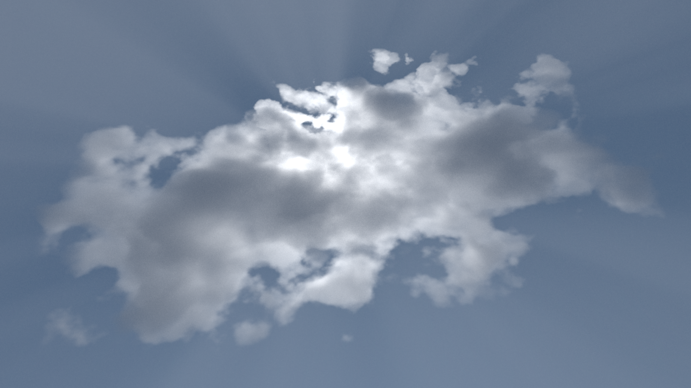
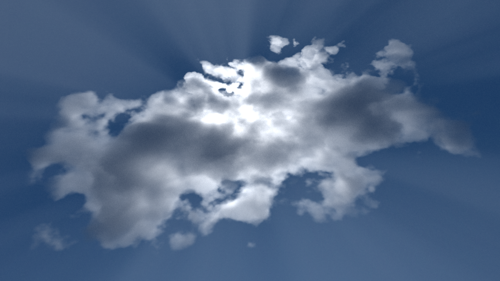
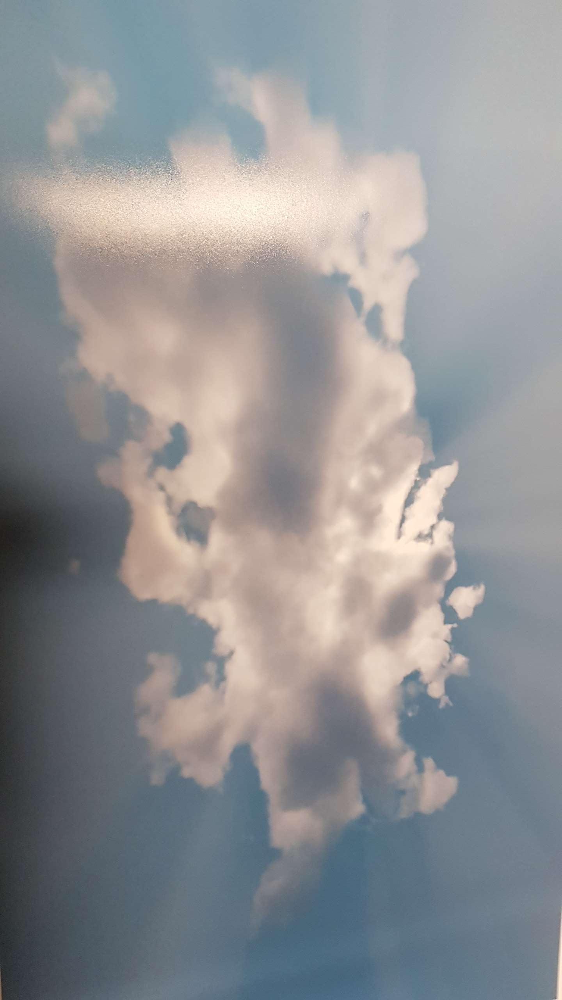
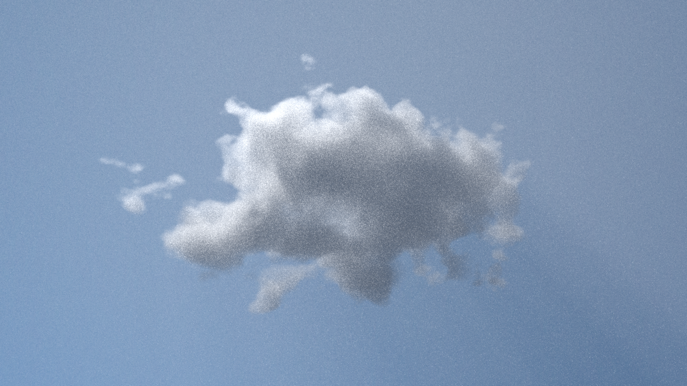
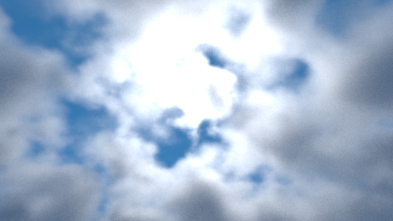

# Procedural Clouds and God Rays
We implemented **Procedural Clouds** and a **Volumetric Path Tracer** capable of rendering them. We use unbiased methods to render **Participating Media**.

Since clouds are an heterogeneous medium, we simulate interactions by **delta tracking** and estimate transmittance by **ratio tracking**. Our volumetric path tracer uses **Multiple Importance Sampling (MIS)** to reduce variance.

In a nutshell, our procedural clouds use volumetric **Perlin noise** w/ several frequency octaves weighted with **SDFs** to provide a certain shape.

God rays are volumetric shadows produced by the difference in density of the cloud and a thin medium (air with some scattering) to visualize them.

# Cool results
## Procedural clouds and God Rays
Big cloud blocking the sun, producing god rays.

**Render with noise**

**Render with noise + enhanced**

**Denoised enhanced**

*To be added*

**Printed**

## Little Disneysh cloud

## Sky
